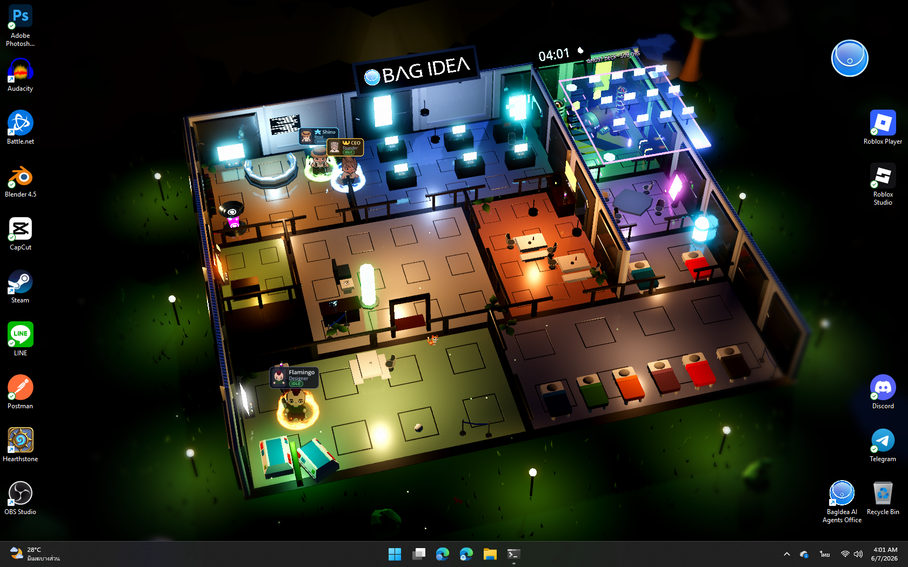

# Getting Started with BagIdea Office

> A living AI office on your wallpaper — every employee is a real Claude agent



## 1. Install

**Windows** — open PowerShell and run a single line:

```powershell
irm https://raw.githubusercontent.com/bagidea/bagidea-office/main/installer/install.ps1 | iex
```

**macOS** (beta) — open Terminal:

```bash
curl -fsSL https://raw.githubusercontent.com/bagidea/bagidea-office/main/installer/install-mac.sh | bash
```

**Linux** (Ubuntu/Debian · 🧪 experimental) — open Terminal:

```bash
curl -fsSL https://raw.githubusercontent.com/bagidea/bagidea-office/main/installer/install-linux.sh | bash
```

> 🧪 Linux is still **experimental** — on **X11/Xorg** the office runs as a true desktop wallpaper,
> while on **Wayland** it falls back to a fullscreen window pinned to the bottom. If you hit
> install/display issues, please file an [issue](https://github.com/bagidea/bagidea-office/issues)
> with your distro, desktop, and the output of `echo $XDG_SESSION_TYPE`

The installer handles everything **even on a bare machine** — it installs every dependency for you:
Git, Node.js LTS, Rust, **Visual Studio C++ Build Tools** (the linker Rust needs,
and the single most common cause of failed installs), Godot 4.6.3 and the Claude Code CLI →
clones the program to `%LOCALAPPDATA%\BagIdeaOffice` → compiles it → stamps the window icon →
wires the `bagidea` command into PATH and creates a Start Menu shortcut

- **Safe to re-run** — it skips what's already installed; re-running = `git pull` (your data stays intact)
- Anything installed via winget is pulled into the current terminal's PATH immediately, so it can keep going in one pass
- If the machine doesn't have the C++ Build Tools yet, the installer downloads them (~2–4 GB, one time) — so the first run takes a little longer

> Install didn't go through? See **[Install troubleshooting](troubleshooting.md)**
> — it covers every symptom (winget missing, build fail, PATH not updating, SmartScreen blocking) with step-by-step fixes

**First time only:** open a **new** terminal (so PATH picks up the `bagidea`/`claude` commands),
run `claude` once to log into your Claude account, then:

```powershell
bagidea start
```

### If you'd rather install it yourself (manual)

```powershell
# 1) deps (skip ones you already have)
winget install Git.Git OpenJS.NodeJS.LTS Rustlang.Rustup
winget install Microsoft.VisualStudio.2022.BuildTools --override `
  "--quiet --wait --add Microsoft.VisualStudio.Workload.VCTools --includeRecommended"
npm install -g @anthropic-ai/claude-code
# 2) open a new terminal, then clone + build
git clone https://github.com/bagidea/bagidea-office.git "$env:LOCALAPPDATA\BagIdeaOffice\app"
cd "$env:LOCALAPPDATA\BagIdeaOffice\app\shell"; cargo build --release
# 3) download Godot 4.6.3 (win64), place it, then set the BAGIDEA_GODOT env var to point at the exe
```

(The one-line installer above already does all of this — the manual route is for people who want full control)

## 2. What happens when you launch

1. A round logo pulses in the center of the screen for a moment (the world is loading)
2. Your wallpaper turns into an **HD-2D office building** — sitting *behind* your desktop icons
3. A circular **chat head** floats in the corner + an icon in the system tray

| Action | Result |
|---|---|
| Click the chat head | Open/close the chat window |
| Right-click the chat head | Toggle 📡 feed mode (a live event stream bar) |
| Right-click the tray icon | Menu: Hide office / Start with Windows / Exit |

The office's lighting/sky follows your machine's real clock — at 4 AM it's genuinely dark, and the garden lamps actually come on

## 3. Your first chat

When the program opens, the chat window **focuses on the CEO 👑 seat (you)** right away — you can give orders as the
CEO immediately (see section 4). A fresh office ships with 2 people: **you (CEO)** and **Shino** —
your right hand in the **Director** role (office manager), a playful young guy who's serious about work,
focused mainly on delegating and managing the team. To talk to Shino directly, click his seat
(⭐ next to the CEO) and type:

```
Hi! Introduce yourself, and tell me what this office can do.
```

Try giving a real task:

```
Research the pros and cons of 3 popular static site generators, then summarize them in a table.
```

If the task can be split, you'll see him **fork into ghosts** — translucent clones that float up and
work in parallel on the Ghost Deck, then merge back to summarize the result — all real sessions, reviewable in 🧵

## 4. Giving orders through the CEO (you)

The gold 👑 seat is you — type into that box and the Director will **walk over to your desk to take the order**,
plan it, delegate to the team (you'll see the handoffs walking across the wallpaper), and when the work is done
he'll walk back to deliver a summary report right to you

## 5. Usage tips

Extra tools live in the **⋯ (More)** menu on the chat window header — open it to see everything

### 🌐 Change language (14 languages)

Press **⋯ → 🌐 Language** for a list of languages; switching applies instantly across the whole program
(it's an office-wide setting, remembered per machine) — full translations ship built in, so you can switch right away
even without a Gemini key

Supports 14 languages: English, ไทย (Thai), 中文 (Chinese), Español (Spanish), हिन्दी (Hindi),
العربية (Arabic), Português (Portuguese), Русский (Russian), 日本語 (Japanese),
Deutsch (German), Français (French), 한국어 (Korean), Indonesia, Tiếng Việt (Vietnamese)

### 🗺 Office map (live map)

Press **⋯ → 🗺 Map** to open the office floor plan overlay. You'll see every employee as an icon (face, name,
and a colored ring for status) moving with their real position on the wallpaper — **click an employee to talk to them**
(the map closes and the chat window focuses on that person). Translucent ghost clones 👻 also appear on the map,
but are view-only

### 🖥 Multi-monitor

Using multiple monitors? Press **⋯ → 🖥 Display** to choose which monitor the office appears on
(primary / 2nd / 3rd…); the list shows however many monitors are actually detected.
When you pick a new monitor, the office **restarts itself briefly** to move to it

## 6. Next steps

- [Hire more employees + set up personas](agents.md)
- [Create projects for agents to work in real folders](projects.md)
- [Let agents open the web & click through tasks for you (web automation)](web-automation.md)
- [Give orders by voice + feed mode](voice-feed.md)
- [Connect Telegram to give orders from your phone](channels.md)
